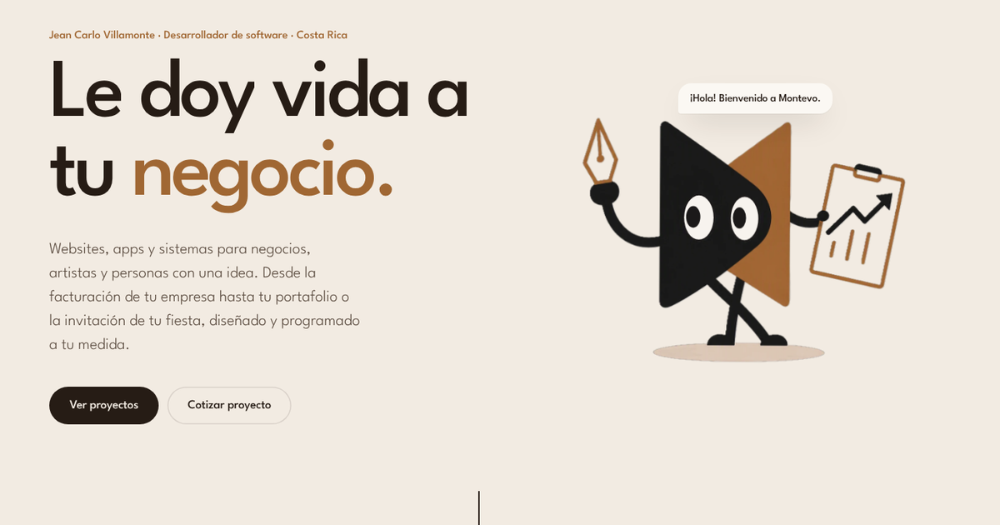

<div align="center">

<a href="https://montevostudio.com">
  
</a>

# Montevo Studio

**Le doy vida a tu idea.** Websites, apps y sistemas a la medida para negocios, artistas y personas en Costa Rica.

[**montevostudio.com**](https://montevostudio.com) · [WhatsApp](https://wa.me/50663331383) · [Instagram](https://instagram.com/montevo.studio) · [montevostudio@outlook.com](mailto:montevostudio@outlook.com)


</div>

---

## Sobre el sitio

Este es el sitio de Montevo Studio, el estudio de software de Jean Carlo Villamonte Murillo.
Está hecho a mano, sin frameworks, para que cargue rápido y se sienta vivo:

- ⚡ **Rápido**: TypeScript + Vite, sin librerías pesadas. Todo el JavaScript pesa menos de 50 kB.
- 🎞️ **Fluido**: las animaciones usan solo `transform` y `opacity` para mantenerse a 60 fps.
- ♿ **Accesible**: navegación con teclado, enlace "Saltar al contenido" y respeto a `prefers-reduced-motion`.
- ✉️ **Formulario de contacto real**: llega directo al correo, sin guardar datos.
- 🔎 **Listo para Google**: datos estructurados, imagen para compartir, `sitemap.xml` y `robots.txt`.

## Cómo funciona

```
Visitante ──► montevostudio.com (Cloudflare Pages)
                 │
                 ├─ Sitio estático  (dist/, generado por Vite)
                 └─ POST /api/contact (Pages Function) ──► Resend ──► montevostudio@outlook.com
```

Cada push a `main` se publica solo en **montevostudio.com**. Cada otra rama genera
su propio link de vista previa en `*.pages.dev`, para revisar los cambios antes de publicarlos.

## Desarrollo

Necesitas Node 22.

```bash
npm install
npm run dev          # http://localhost:5173
npm run build        # verifica tipos y genera /dist
```

Para probar también el formulario de contacto en tu compu:

```bash
echo 'RESEND_API_KEY=re_xxx' > .dev.vars   # no se sube a git
npm run pages:dev                          # http://localhost:8788
```

## Tareas comunes

### Agregar un proyecto al portafolio

Todo está en **`src/content/projects.ts`**: copia un bloque, cambia los textos y listo.
Los campos están tipados en `src/types.ts`, así que el editor te autocompleta y te avisa si falta algo.

- **Imágenes (opcional):** ponlas en `public/projects/<slug>/` y referencia
  `cover: 'projects/<slug>/cover.jpg'` o `gallery: ['projects/<slug>/01.jpg']`.
  Sin imagen, la portada se genera con los `colors` del proyecto.
- Cada proyecto tiene su propio link: `/#/proyecto/<slug>`.

### Cambiar textos, servicios o preguntas frecuentes

Están directamente en **`index.html`**, sección por sección.

### Cambiar las herramientas de la sección Tecnología

En **`src/content/stack.ts`**.

### Cambiar colores o tipografía

Los tokens están al inicio de **`src/styles.css`**.

## Formulario de contacto

`functions/api/contact.ts` recibe el formulario en `POST /api/contact` y envía un
correo con [Resend](https://resend.com) desde `hola@montevostudio.com`. No guarda nada.

- Tiene un campo oculto anti-spam (*honeypot*).
- Si el cliente dejó su correo, el botón **Responder** le escribe directo a él.

## Publicación

| Pieza            | Dónde                                                              |
| ---------------- | ------------------------------------------------------------------ |
| Hosting          | Cloudflare Pages, proyecto `website`, conectado a este repo       |
| Build            | `npm run build` → `dist`, con `NODE_VERSION=22`                    |
| Dominio          | `montevostudio.com` (`www` redirige aquí; DNS en Cloudflare)       |
| Correo           | Resend, dominio `montevostudio.com` verificado                    |
| Buscador         | Google Search Console, con `sitemap.xml` enviado                   |

Variables del proyecto (Cloudflare → Settings → Variables and Secrets, en Production y Preview):

| Variable         | Valor                                       |
| ---------------- | ------------------------------------------- |
| `RESEND_API_KEY` | *Secret*: clave de Resend con permiso solo de envío |
| `CONTACT_TO`     | `montevostudio@outlook.com`                 |
| `CONTACT_FROM`   | `Montevo Studio <hola@montevostudio.com>`   |

## Estructura

```
index.html              contenido de las secciones
src/main.ts             arranca cada interacción
src/content/projects.ts proyectos del portafolio
src/content/stack.ts    herramientas de la sección Tecnología
src/modules/            una interacción por archivo (mascota, scroll, filtros…)
src/styles.css          estilos (tokens de color y tipografía arriba)
functions/              funciones de Cloudflare (formulario y redirección www)
public/                 archivos tal cual: íconos, imagen para compartir, sitemap, robots
public/_headers         caché y cabeceras de seguridad
```

---

<div align="center">

Hecho con cariño en Costa Rica 🇨🇷 · © Montevo Studio

</div>
